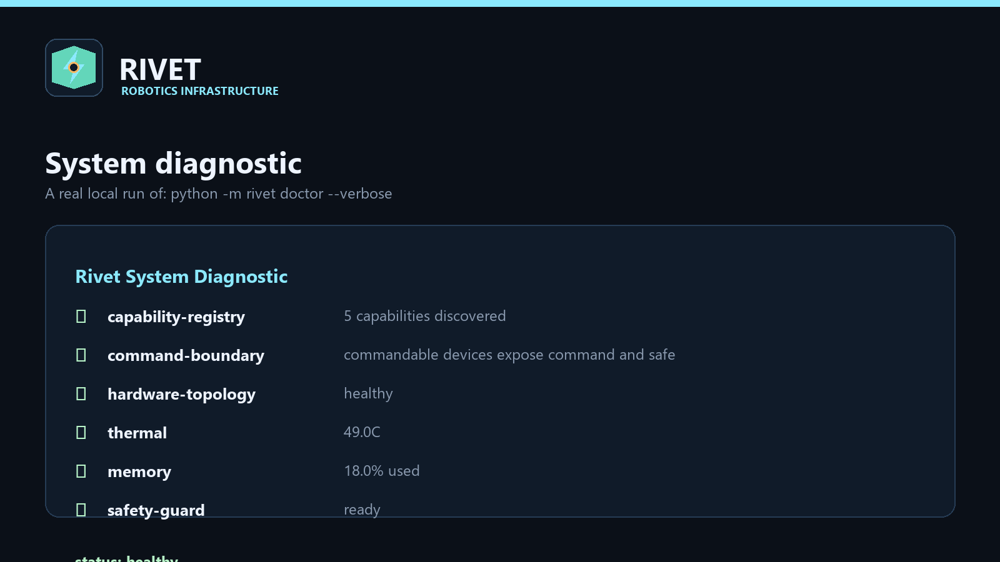
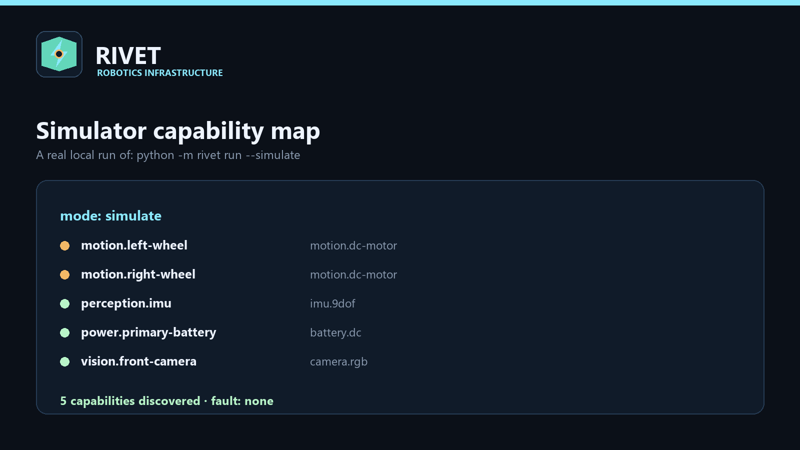
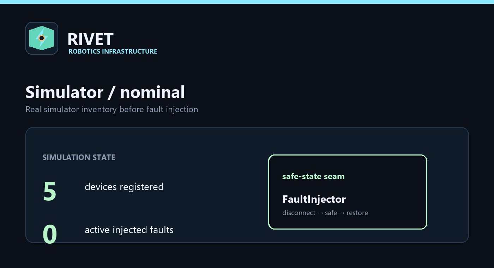
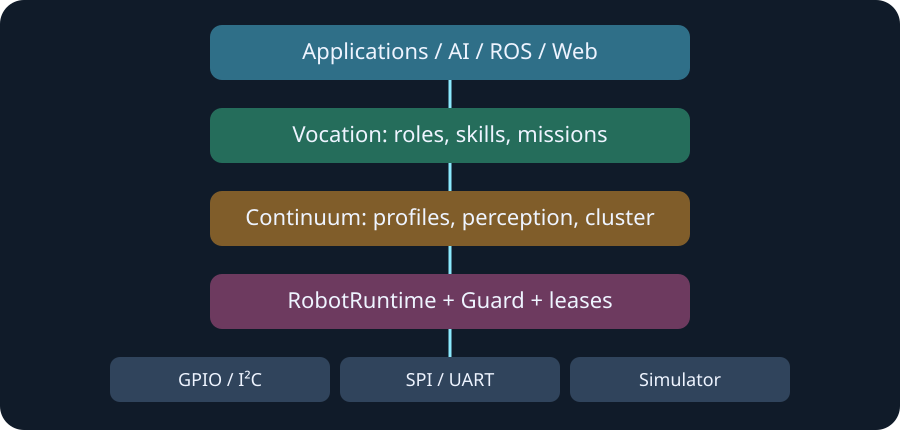

<p align="center">
  
</p>

<p align="center">
  <strong>Safety-first infrastructure for adaptive Raspberry Pi robotics.</strong><br>
  Discover hardware. Build capability. Keep authority explicit.
</p>

<p align="center">
  <a href="site/pages/getting-started.html">Getting started</a> ·
  <a href="site/pages/architecture.html">Architecture</a> ·
  <a href="docs/architecture.md">Documentation</a> ·
  <a href="examples/rover.yaml">Example manifest</a>
</p>

Rivet is an installable Python runtime and capability platform for robots that need a clear boundary between **what hardware exists**, **what the robot is qualified to do**, and **what it is currently allowed to command**. The core runs without Pi hardware through a deterministic simulator, while physical adapters remain explicit integrations rather than hidden claims.

> **Current status:** Rivet `1.2.0` is a verification-gated beta release. Its dependency-free simulator, capability contracts, safety boundary, fault scenarios, role/skill model, recorder, release audit, and package checks run locally and in CI. Physical adapters remain explicit integrations rather than certification claims, and Rivet is not a certified safety controller or autonomous authorization system.

## Rivet 1.2.0 is released

The current release is available from [PyPI](https://pypi.org/project/rivet-robot-runtime/1.2.0/) and the [GitHub release page](https://github.com/theworker02/rivet/releases/tag/v1.2.0).

### Install from PyPI

The normal installation installs the runtime and both public CLI entry points:

```bat
python -m pip install --upgrade rivet-robot-runtime==1.2.0
rivet version --verbose
rivet verify
```

`python -m rivet` is equivalent to the installed `rivet` command. The developer companion command is `rivet-dev`:

```bat
rivet --help
rivet-dev --help
rivet-dev audit-content
```

For an upgrade from an earlier release:

```bat
python -m pip install --upgrade rivet-robot-runtime
python -m rivet version
```

Optional extras are intentionally separate from the dependency-free runtime:

| Extra | Installs | Use |
| --- | --- | --- |
| `pi` | `gpiozero` | Pi-oriented adapter integration |
| `vision` | `numpy` | Optional numerical vision integration |
| `dev` | pytest, Ruff, mypy, build, pinned setuptools | Tests, static checks, and local release builds |
| `docs` | MkDocs | Documentation tooling |
| `all` | All optional dependencies | Full development environment |

Install an extra with `python -m pip install "rivet-robot-runtime[dev]==1.2.0"`. The base package does not import Pi-only libraries or require physical hardware.

### Release artifacts

The CLI is shipped inside the standard Python package; there is no separate CLI download. The 1.2.0 release contains these actual artifacts:

| Artifact | Format | Purpose | Verified source |
| --- | --- | --- | --- |
| `rivet_robot_runtime-1.2.0-py3-none-any.whl` | Universal wheel | Fast installation on supported Python 3.10–3.13 environments | [GitHub release asset](https://github.com/theworker02/rivet/releases/download/v1.2.0/rivet_robot_runtime-1.2.0-py3-none-any.whl) |
| `rivet_robot_runtime-1.2.0.tar.gz` | Source distribution | Rebuild or audit the source package locally | [GitHub release asset](https://github.com/theworker02/rivet/releases/download/v1.2.0/rivet_robot_runtime-1.2.0.tar.gz) |

Both artifacts are also published through [PyPI](https://pypi.org/project/rivet-robot-runtime/1.2.0/). The published SHA-256 digests are:

```text
rivet_robot_runtime-1.2.0-py3-none-any.whl
5ee535e3d61e802f71a37defdacf6e3dcb2a50ed8a846e2eab84ef5103e30040

rivet_robot_runtime-1.2.0.tar.gz
4845c873f25eeefde0f4d27663a165f5c3f731231c1f5309dadb829902a4b3e3
```

Verify a downloaded artifact on Windows:

```bat
certutil -hashfile rivet_robot_runtime-1.2.0-py3-none-any.whl SHA256
certutil -hashfile rivet_robot_runtime-1.2.0.tar.gz SHA256
```

On Linux or macOS:

```bash
sha256sum rivet_robot_runtime-1.2.0-py3-none-any.whl
sha256sum rivet_robot_runtime-1.2.0.tar.gz
```

### What changed in 1.2.0

- **Verification pipeline:** `rivet verify` checks configuration, startup, driver discovery, capability registration and health, safety, roles, skills, missions, simulation, command/telemetry, recorder/replay, and graceful shutdown.
- **Executable reliability scenarios:** 18 simulator scenarios cover boot, discovery, role assignment, mission admission, sensor recovery, watchdogs, resource pressure, recording/replay, multi-robot coordination, dry runs, Reflex, Pulse, Capsules, and fault-domain isolation.
- **Operational signals:** capability health, Pulse heartbeats, bounded recovery, fault domains, typed units, configuration migration, mission checkpoints, compensation, sanitized support bundles, and compatibility/resource checks.
- **Release quality gates:** `rivet check-release` and `rivet-dev audit-content` validate tests, documentation links/assets, examples, schemas, metadata, package artifacts, and unfinished release content.
- **Documentation and packaging:** the README, static site, architecture material, driver evidence, simulator workflows, safety boundaries, and installable wheel/sdist were updated for the Beta release.

For the complete chronological history, see [`CHANGELOG.md`](CHANGELOG.md). Release claims remain bounded: simulator PASS results do not certify physical hardware, and physical drivers must provide their own evidence and deployment review.

## See it run

These visuals are generated from real local Rivet commands and simulator APIs. They are not fabricated robot footage or screenshots of hardware.

<table>
  <tr>
    <td width="50%"></td>
    <td width="50%"></td>
  </tr>
  <tr>
    <td align="center"><sub><strong>System diagnostics</strong><br><code>python -m rivet doctor --verbose</code></sub></td>
    <td align="center"><sub><strong>Capability discovery</strong><br><code>python -m rivet run --simulate</code></sub></td>
  </tr>
</table>

<p align="center">
  
</p>

<p align="center"><sub>Rivet 1.2.0 verification is generated from real local commands. Physical adapters remain explicit evidence-bearing integrations.</sub></p>

## Why Rivet exists

Robotics projects often grow in the wrong direction: applications reach directly into GPIO, device-specific code owns safety policy, and a role description becomes an untestable collection of assumptions. Rivet keeps those concerns visible and composable.

| Question | Rivet boundary |
| --- | --- |
| What is connected? | Device contracts, driver registry, capability discovery, and topology |
| Can this command run? | Authority grants, actuator leases, preflight, and `RivetGuard` |
| What happens when resources change? | Continuum profiles, lifecycle, governors, provenance, and offline cluster primitives |
| What is this robot qualified to do? | Roles, SkillGraph evidence, benchmarks, passports, and explicit state transitions |
| Can a behavior transfer safely? | Synapse stages, embodiment-neutral Motion IR, assumptions, and validation gates |
| Why was a decision made? | Mission admission, team explanations, EchoMap evidence, and event records |

## The architecture

Rivet is additive. Higher-level capability never bypasses the lower-level authority boundary.

<p align="center">
  
</p>

```text
Applications / AI / ROS / Web
              │
              â–¼
 VocationRuntime — roles, skills, missions, teams
              │
              â–¼
 ContinuumRuntime — profiles, perception, resources, cluster
              │
              â–¼
 RobotRuntime — devices, capabilities, authority, leases
              │
              â–¼
 physical adapters or dependency-free simulator
```

### Runtime layers

- **RobotRuntime** is the command boundary. It owns capability registration, authority grants, leases, command dispatch, event publication, and simulator integration.
- **RivetGuard** is the heartbeat and emergency-stop boundary. Expired heartbeats transition commandable devices to their safe state and revoke active control.
- **ContinuumRuntime** models resource profiles, lifecycle, perception provenance, hardware topology, offline nodes, and adaptation decisions.
- **VocationRuntime** composes roles, competency evidence, transfer packages, mission planning, passports, experience marks, and team assignment without replacing runtime safety.

## Install and run

Requires Python 3.10 or newer. The base runtime has no mandatory hardware, vision, or network dependency.

### From a checkout

```bat
python -m pip install -e ".[dev]"
python -m rivet doctor --verbose
python -m rivet run --simulate
```

On a Unix-like shell, use:

```bash
python -m pip install -e ".[dev]"
python -m rivet doctor --verbose
python -m rivet run --simulate
```

### First commands

```text
rivet verify                       # run the end-to-end installation health gate
rivet check-release                # block releases on known quality failures
rivet version --verbose            # show version and diagnostic identifiers
rivet devices                       # list simulated capabilities
rivet discover                      # inspect capability contracts
rivet tree                          # render the device tree
rivet doctor --verbose              # run diagnostics
rivet preflight                     # validate before motion
rivet run --simulate                # run the dependency-free backend
rivet run --simulate --fault motion.left-wheel
```

Create a local configuration without touching hardware:

```bat
python -m rivet init rover.json --robot-id atlas-demo
```

Run the end-to-end Vocation demonstration:

```bat
python -m rivet vocation-demo
python -m rivet role evaluate search-rescue
python -m rivet skill explain construction.drilling
python -m rivet passport export
python -m rivet mission explain "search building sector B"
python -m rivet team organize
```

## A small Python integration

The public runtime API is deliberately small enough to use from an application, SDK adapter, or test fixture:

```python
from rivet import RobotRuntime
from rivet.simulator import SimulatedRobot

runtime = RobotRuntime()
runtime.register_simulator(SimulatedRobot())

for capability in runtime.discover():
    print(capability["path"], capability["type"])
```

Commandable devices still require the normal authority and lease flow. Discovery is not permission:

```python
grant = runtime.acquire_control("motion", "operator", priority=500, ttl_s=5.0)
lease = runtime.acquire_lease(
    "motion.left-wheel", "operator", grant.token, ttl_s=0.25
)
runtime.command(
    "motion.left-wheel", "velocity", 0.35,
    "operator", grant.token, lease.token,
)
```

## What is included

### Hardware abstraction and simulation

- Formal `Device`, `CommandableDevice`, `Driver`, and `DriverRegistry` contracts.
- Mock GPIO, I²C, SPI, UART, motor, camera, and sensor drivers for deterministic tests.
- Capability descriptors with command schemas, telemetry, safety policy, and metadata.
- CRC-protected Rivet Link frame encoding and decoding.
- Fault injection that removes a simulated device, invokes its safe state, emits a fault event, and supports restoration.
- Optional physical dependencies kept outside core imports so `import rivet` works on machines without Pi hardware.

### Continuum

- Resource profiles and governor decisions for constrained hosts.
- Lifecycle and capability request handling.
- Perception clock, buffers, provenance, confidence, and explainable observations.
- Hardware graph, offline node registry, assignment, migration, and heartbeat expiry.
- Diagnostics and preflight checks suitable for local development and CI.

### Vocation

- Role definitions with hardware requirements, competencies, policies, and prohibited actions.
- Qualification states: `candidate → trained → validated → authorized`.
- SkillGraph evidence with prerequisites, curricula, benchmark records, confidence decay, and history.
- Synapse packages that transfer intent, assumptions, failure modes, and validation requirements.
- Embodiment-neutral Motion IR lowered through the existing runtime command boundary.
- Signed-style Rivet Passport exports using dependency-free HMAC in the prototype.
- Mission decomposition, admission checks, explanations, and competence-based team assignment.
- EchoMap experience marks with evidence and sensor provenance.

### Verification and operations

- `rivet verify` validates configuration, runtime startup, driver discovery, capability registration/health, safety, roles, skills, mission parsing, simulation, command/telemetry, recorder, replay, and graceful shutdown.
- Eighteen executable end-to-end scenarios cover boot, role and mission flow, sensor recovery, watchdogs, resource pressure, recording/replay, dry runs, multi-robot registration, Reflex, Pulse, Capsules, and fault-domain isolation.
- Typed units and capability contracts distinguish distance, velocity, angle, force, voltage, current, temperature, duration, and frequency and enforce command ranges before dispatch.
- Health states, Pulse signals, bounded recovery, and fault domains expose degraded capabilities without turning them into authority.
- Versioned configuration migration, mission checkpoints/compensation, deterministic timelines, sanitized crash reports, support bundles, compatibility matrices, resource tiers, and performance budgets are available through the CLI.
- `rivet check-release` and `rivet-dev audit-content` are strict quality gates for tests, docs, examples, metadata, package artifacts, and unfinished release content.


A role evaluation reports compatibility. It does not authorize motion.

```text
candidate ──training──▶ trained ──validation──▶ validated ──operator decision──▶ authorized
                                                                                  │
                                                                                  â–¼
                                                        still subject to Guard, leases, and preflight
```

A passport qualification is evidence. It is not an actuator token, lease, emergency-stop bypass, production identity, or permission to perform prohibited actions.

## Examples

| Example | Demonstrates |
| --- | --- |
| [`examples/differential-drive`](examples/differential-drive) | Discovery, authority, actuator lease, command, and safe expiry |
| [`examples/robot-arm`](examples/robot-arm) | Motion IR and a validated intent boundary without hardware claims |
| [`examples/camera-rover`](examples/camera-rover) | Camera capability metadata and perception provenance |
| [`examples/pico-bridge`](examples/pico-bridge) | Rivet Link framing and a deterministic UART boundary |
| [`examples/role-assignment`](examples/role-assignment) | Role evaluation and prerequisite-aware skills |
| [`examples/rover.yaml`](examples/rover.yaml) | A compact robot manifest for local experimentation |

Run the differential-drive example:

```bat
set PYTHONPATH=src
python examples\differential-drive\main.py
```

## Repository map

```text
src/rivet/
├── runtime.py             command, authority, lease, and event boundary
├── device.py              device and capability contracts
├── driver.py              driver protocol and registry
├── protocol.py            CRC-protected Rivet Link frames
├── configuration.py       JSON configuration loader
├── storage.py             atomic local JSON storage
├── simulator.py            dependency-free reference robot
├── faults.py              simulation-only fault injection
├── continuum.py           profiles, governor, and lifecycle
├── guard.py               heartbeat safety boundary and estop
├── perception.py          provenance, buffers, and explainable insight
├── cluster.py             offline node registry and migration
├── vocation.py            roles and qualification transitions
├── skills.py              SkillGraph, curricula, evidence, and decay
├── benchmarks.py          RivetBench result catalog
├── synapse.py             transferable skill-package stages
├── motion_ir.py           embodiment-neutral intent and executor
├── passport.py             signed-style qualification export
├── echomap.py             explainable spatial experience marks
├── mission.py             decomposition, admission, and explanation
├── team.py                competence-based team assignment
├── vocation_runtime.py    Vocation composition layer
├── cli.py                  public `rivet` command surface

drivers/                   reference and mock hardware adapters
sdk/                       schemas and thin SDK examples
examples/                  runnable simulator-first examples
docs/                      structured project documentation
site/                      static public documentation and brand assets
tools/                    developer, release, site, and media tooling
tests/                    unit, integration, protocol, hardware, and simulation tests
```

## Development and release checks

Install developer tooling and run the normal gate:

```bat
python -m pip install -e ".[dev]"
python -m pytest
python -m ruff check src tests drivers sdk
python -m mypy src
python -m compileall -q src drivers sdk tests
python -m rivet verify
rivet-dev audit-content
python -m rivet check-release
```

Regenerate the visual evidence after changing simulator or diagnostic output:

```bat
python tools\media\generate.py
```

The release artifacts are built with:

```bat
python -m pip install "setuptools==81.0.0"
python -m build --no-isolation --skip-dependency-check --wheel
python -m build --no-isolation --skip-dependency-check --sdist
```

The static site source is copied to `site-build/` for Pages deployment. Generated output is not hand-edited.

## Safety, scope, and honesty

Rivet 1.2.0 is a verification-gated Beta release, not a claim of universal physical readiness. The following remain explicit deployment boundaries:

- No claim of production Raspberry Pi hardware support for every adapter listed here.
- No unconditional import of `RPi.GPIO`, libcamera, serial, or vision libraries.
- No autonomous certification of dangerous capabilities.
- No medical-procedure, covert-surveillance, radiation, or hazardous-material automation.
- No production cryptographic device identity; the passport signer is a local prototype seam.
- No process-isolated safety service or certified emergency-stop implementation.
- No fake screenshots, stock robot footage, or fabricated hardware benchmarks: the visuals in this README are generated from actual local simulator/diagnostic runs.

For contribution standards, security reporting, governance, and the project roadmap, see [`CONTRIBUTING.md`](CONTRIBUTING.md), [`SECURITY.md`](SECURITY.md), [`GOVERNANCE.md`](GOVERNANCE.md), and [`ROADMAP.md`](ROADMAP.md).

## License

Rivet is released under the [MIT License](LICENSE). Hardware deployments remain responsible for their own electrical, mechanical, operational, and regulatory safety review.


---

## License & acquisition

This project is **proprietary**. Production use, redistribution, and commercial deployment require a written commercial license or completed acquisition. See [LICENSE](./LICENSE) and [ACQUISITION.md](./ACQUISITION.md). Contact [@theworker02](https://github.com/theworker02).

## Acquisition diligence

Buyer-facing diligence materials live in [docs/acquisition/](./docs/acquisition/). Commercial licensing contact path: [COMMERCIAL.md](./COMMERCIAL.md).
